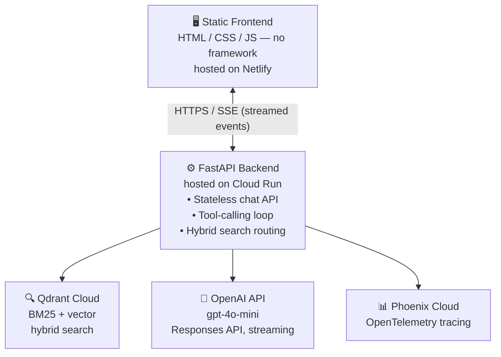

# Christchurch Dining AI Agent

A production-grade, conversational RAG agent for discovering restaurants in
Christchurch, New Zealand — built end-to-end as an LLM Zoomcamp capstone
project, then deployed and load-tested like a real product rather than a
notebook demo.

**🔗 Live demo:** https://chc-foodie-agent.netlify.app <br>
**🔗 API docs (Swagger UI):** https://restaurant-rag-api-687671202987.australia-southeast1.run.app/docs

> ⏱️ **First message may take 20–30 seconds.** The backend runs on Cloud
> Run's scale-to-zero tier — if it's been idle, the first request triggers a
> cold start (loading two ML models + building a search index from scratch).
> Subsequent messages are fast. This is a deliberate cost trade-off, explained
> in [Deployment](#deployment--infrastructure) below.

---

## Table of Contents

- [Problem Statement](#problem-statement)
- [Architecture](#architecture)
- [Tech Stack](#tech-stack)
- [How It Works](#how-it-works)
- [Key Engineering Decisions](#key-engineering-decisions--interesting-problems-solved)
- [Evaluation](#evaluation)
- [Monitoring & Observability](#monitoring--observability)
- [Running Locally](#running-locally)
- [Deployment](#deployment--infrastructure)
- [Project Structure](#project-structure)
- [LLM Zoomcamp Evaluation Criteria Mapping](#llm-zoomcamp-evaluation-criteria-mapping)
- [Known Limitations & Future Work](#known-limitations--future-work)

---

## Problem Statement

Finding a restaurant in an unfamiliar city usually means juggling several
disconnected tools: a maps app for distance, a review site for quality, and
a search engine for hours and contact details — and none of them understand
follow-up questions like *"when does it reopen after lunch?"*

This project is a single conversational assistant that answers natural-
language questions about **647 restaurants** in Christchurch, NZ, grounded
entirely in real review and metadata content — not the LLM's general
knowledge. It can:

- Recommend restaurants by cuisine, price, or vibe, using actual review text
- Answer factual questions (address, phone, hours, services) precisely,
  without padding the answer with unrequested details
- Correctly handle **split operating hours** (e.g. lunch service, a gap,
  then dinner service) rather than assuming a single closing time
- Filter by real-time proximity when the user shares their location,
  automatically triggering the browser's native location prompt only when
  a query genuinely needs it
- Stream its reasoning live: a visible "searching → found N results" trace
  appears in the chat as the retrieval step runs

The dataset is Google Maps / review data for Christchurch restaurants,
embedded and indexed into Qdrant Cloud.

## Architecture



The frontend never talks to Qdrant, OpenAI, or Phoenix directly — it only
calls the FastAPI backend, which owns all secrets and all retrieval logic.

The frontend never talks to Qdrant, OpenAI, or Phoenix directly — it only
calls the FastAPI backend, which owns all secrets and all retrieval logic.

## Tech Stack

| Layer | Technology | Why |
|---|---|---|
| LLM | OpenAI `gpt-4o-mini`, Responses API, streaming, tool/function calling | Cost-effective; native tool calling avoids brittle prompt-parsing |
| Vector search | Qdrant Cloud | Managed, supports hybrid search + payload filtering natively |
| Embeddings | `sentence-transformers/all-mpnet-base-v2` | Strong general-purpose semantic embeddings, runs on CPU |
| Keyword search | `rank-bm25` (BM25Okapi) | Classic lexical search, fused with vector search via **Reciprocal Rank Fusion** |
| Re-ranking | `cross-encoder/ms-marco-MiniLM-L-6-v2` | Cross-encoder reranking is meaningfully more accurate than embedding similarity alone for the final top-5 |
| Backend | FastAPI, stateless, Server-Sent Events | No session storage — the client owns conversation history; backend just validates and sanitizes it each turn |
| Frontend | Vanilla HTML/CSS/JS, no build step | Deliberate choice — keeps the deployable artifact trivial (static files, no bundler, no node_modules) |
| Observability | Arize Phoenix Cloud, OpenTelemetry | Full span hierarchy per chat turn: chain → LLM call → tool call → retriever |
| Backend hosting | Google Cloud Run | Scale-to-zero, pay-per-request — chosen after directly measuring that Render/Railway's fixed memory tiers were insufficient (see below) |
| Frontend hosting | Netlify | Static site, zero-config, free tier |
| Containerization | Docker + docker-compose | Single `Dockerfile` used for both local dev and the production Cloud Run image |

## How It Works

1. **Ingestion** (`build_index.py`) — restaurant + review data is embedded
   with `all-mpnet-base-v2` and upserted into a Qdrant Cloud collection,
   along with structured metadata (hours, price, services, coordinates)
   merged in from an enriched features parquet file.
2. **Query arrives** at `POST /api/chat` as the *entire* conversation
   history (the backend is stateless — see [Key Engineering
   Decisions](#key-engineering-decisions--interesting-problems-solved)).
3. **The LLM decides** whether to call `smart_restaurant_search`, and
   crucially, whether the query has **proximity intent** — this is decided
   by the model via an explicit boolean tool parameter, not by regex
   keyword-matching (see below for why that distinction mattered).
4. **Retrieval routes by query type**:
   - Restaurant-specific factual queries → direct hybrid search filtered
     to that restaurant
   - Comparative/cuisine queries ("best sushi") → multi-query expansion +
     HyDE (Hypothetical Document Embeddings) reranking
   - Proximity queries → Qdrant geo-filtered radius search with exact
     Haversine distance calculation
   - All paths converge through the same cross-encoder reranking step
5. **Results stream back** to the frontend as typed SSE events
   (`tool_call_start`, `tool_call_end`, `text_delta`, `done`), rendered
   live with a custom trace strip showing the search-in-progress.
6. **Every turn is traced** to Phoenix Cloud with the full retrieval
   context, tool inputs/outputs, and a deterministic hallucination check
   (below) attached as a span attribute.

## Key Engineering Decisions & Interesting Problems Solved

These are the parts of the build that involved real debugging and design
trade-offs, not just wiring libraries together.

**Two-tier location-intent classification.** Initially, "does this query
want nearby results?" was decided by keyword matching (`'close'`, `'near'`,
`'around'`, etc.). This produced a real false positive: *"when does it
close today?"* was misclassified as a proximity query because of the bare
word "close," sending the system down a `location_required` dead end for a
question that had nothing to do with location. The fix: the tool schema now
exposes an explicit `wants_nearby_search: boolean` parameter that the LLM
itself sets, based on actual intent rather than string matching — the model
already disambiguates this correctly given full conversational context,
which a keyword list structurally cannot.

**Deterministic hallucination guardrails, not just prompting.** Despite
explicit prompt instructions, the model would occasionally invent plausible
-sounding distances ("Restaurant X, 1.2km away") for results that had no
`distance_km` field at all. Prompt engineering alone reduced but didn't
eliminate this. The actual fix pairs a tightened prompt rule with a
**code-level check** (`_check_distance_hallucination`) that inspects the
raw tool output against the generated reply and logs a flag to Phoenix if
they disagree — turning a silent quality issue into a measurable, traceable
one.

**Split-hours handling.** Restaurants with lunch/dinner gaps (e.g.
`11:30 AM–2:30 PM, 5–9 PM`) were getting answered as if they closed for the
day after lunch. Fixed by requiring the model to check *all* comma-separated
periods in a day's hours string, not just the next closing time surfaced by
the temporal-context block.

**Diagnosing a real OpenTelemetry context-propagation bug.** Tool-call and
retriever spans were silently missing from Phoenix traces — only the
top-level chain span showed up. Root cause: spans whose lifetime spanned
multiple `yield` statements in the SSE streaming generator could resume on
a *different* worker-pool thread after each yield (Starlette dispatches
each `next()` call on a sync generator through its thread pool
individually), and OpenTelemetry's `contextvars`-based span propagation
does not survive that thread hop. Fixed by switching those specific spans
from the implicit `start_as_current_span()` context-manager pattern to
explicit `start_span()` + manual `.end()` + explicit parent context
passing — confirmed fixed by checking the resulting trace tree showed full
nesting (`assistant-turn → Responses.create → smart_restaurant_search →
retrieve`).

**Memory-constrained cloud deployment, debugged with evidence, not
guesses.** The backend loads two transformer models into memory
(`all-mpnet-base-v2` + a cross-encoder), which made fitting it onto
standard free-tier hosting non-trivial:
- Render's 512MB free/Starter tier was **measured**, not assumed, to be
  insufficient — confirmed via repeated OOM kills in deploy logs during
  cold model loading, even after optimizing thread count
  (`OMP_NUM_THREADS=1`), trimming candidate batch sizes, and replacing the
  full `arize-phoenix` package (which transitively pulls in a GraphQL
  server, SQLAlchemy, and scikit-learn — none of which the app uses) with
  the lightweight `arize-phoenix-otel` client-only package.
- Railway's advertised "$5 Hobby" tier was cost-modeled against its actual
  per-resource billing rates and found to realistically cost ~$20–30/month
  for this workload if run continuously — not chosen.
- Vercel was ruled out architecturally: its 500MB Python deployment-bundle
  cap and stateless serverless execution model are fundamentally
  incompatible with a process designed to keep large models warm in
  memory across requests.
- **Google Cloud Run** was chosen and *validated locally first* — using
  `docker run --memory=1g` to reproduce Cloud Run's exact memory ceiling
  before spending anything on cloud infrastructure — then deployed with
  request-based billing (scale-to-zero), confirmed via Google's own
  documentation that idle (non-reserved) instance time is never billed.

**Stateless backend, sanitized server-side.** The client owns and resends
the full conversation history on every request — there's no server-side
session store to expire or scale. To prevent a tampered client payload from
smuggling its own `developer`-role message to override the system prompt,
the backend strips any client-supplied developer/system messages and always
re-injects its own. Conversation truncation (`cleanup_chat_history`) is
pairing-aware — it won't cut a `function_call` away from its matching
`function_call_output`, which the OpenAI Responses API would otherwise
reject. This was verified with a unit test that exhaustively checks **41
different truncation cut points** against a synthetic 10-turn history,
asserting zero pairing violations at any of them.

## Evaluation

### Retrieval evaluation — multiple strategies, routed by query type

Rather than one fixed retrieval path, the system implements and routes
between several strategies based on classified query intent
(`classify_query_intent`):

| Query type | Strategy |
|---|---|
| Restaurant-specific factual | Direct hybrid (BM25 + vector + RRF) search, filtered to that restaurant's `restaurant_id` |
| Comparative ("best X") / cuisine | Multi-query expansion (GPT-rewritten variants) + HyDE reranking against a hypothetical ideal answer |
| Proximity ("X nearby") | Qdrant geo-bounding-box pre-filter + exact Haversine distance, cuisine-filtered post-retrieval |
| Everything else | Plain hybrid search fallback |

All paths converge through the same cross-encoder reranking stage before
the final top-5 results are returned.

### LLM (output) evaluation

- **Distance hallucination detection** (`_check_distance_hallucination`,
  `api/main.py`) — a deterministic check comparing tool output against the
  generated reply, logged as a Phoenix span attribute
  (`eval.distance_hallucination_detected`) so hallucination rate is a
  measurable, trackable metric over time, not an anecdote.
- **Before/after prompt-engineering comparisons** were used to fix three
  separate accuracy issues (distance hallucination, cuisine mislabeling,
  split-hours handling) — each verified against the same test queries
  before and after the fix, documented above.
- Additional LLM-as-judge style evaluation is implemented in
  `evaluation/evaluators.py`, run via `evaluation/worker.py` against
  Phoenix-logged traces.

## Monitoring & Observability

- **Distributed tracing**: every chat turn produces a full OpenTelemetry
  span tree in Phoenix Cloud — chain span → LLM call span → tool call span
  → retriever span — with retrieved documents, tool inputs/outputs, and
  evaluation flags attached as span attributes. *(Add a screenshot of a
  trace tree here.)*
- **Usage analytics**: every query is logged to a dedicated Qdrant
  collection (`query_analytics`), powering a "popular searches" feature in
  the UI and giving visibility into real usage patterns over time.
- **Structured logging**: the backend logs to stdout (Cloud Run's native
  log aggregation), not local files — deliberately chosen so logs survive
  container restarts and don't trigger spurious file-watcher reload loops
  in development.

## Running Locally

```bash
git clone <this-repo>
cd restaurants-rag-production

cp .env.example .env   # fill in your own keys, see below

docker-compose up --build
```

This starts three services: the FastAPI backend (`http://localhost:8000`),
a local self-hosted Phoenix instance for tracing
(`http://localhost:6006`), and the evaluation worker.

To run the frontend locally instead of via Netlify:
```bash
cd frontend
python3 -m http.server 5500
# open http://localhost:5500
```

### Required environment variables

| Variable | Description |
|---|---|
| `OPENAI_API_KEY` | OpenAI API key |
| `QDRANT_URL` | Qdrant Cloud cluster URL |
| `QDRANT_API_KEY` | Qdrant Cloud API key |
| `COLLECTION_NAME` | Qdrant collection name (`christchurch_restaurants`) |
| `PHOENIX_API_KEY` | Phoenix Cloud API key (optional — falls back to a no-op tracer if unset) |
| `PHOENIX_PROJECT_NAME` | Phoenix project name |
| `PHOENIX_COLLECTOR_ENDPOINT` | Phoenix Cloud space URL, e.g. `https://app.phoenix.arize.com/s/<your-space>` |

### Rebuilding the search index

```bash
python build_index.py
```

## Deployment & Infrastructure

- **Backend**: Google Cloud Run, `australia-southeast1` (Sydney — closest
  available region to Christchurch), 1.5GiB memory, 1 vCPU, scale-to-zero,
  request-based billing.
- **Frontend**: Netlify, deployed directly from this repo's `frontend/`
  directory, no build step.
- **Cost**: designed to run at **$0/month** for portfolio-level traffic.
  Cloud Run's request-based billing only charges for active request
  processing — idle instances are never billed (confirmed directly against
  Google's own pricing documentation, not assumed). A scheduled health
  check (UptimeRobot, 5-minute interval against `/api/health`) keeps the
  instance from fully cold-starting between visits, at no extra cost,
  since pinging more frequently than Cloud Run's ~15-minute idle-shutdown
  window keeps it warm without ever crossing into billed idle time.

## Project Structure

## LLM Zoomcamp Evaluation Criteria Mapping

| Criterion | Score | Where to find it |
|---|---|---|
| Problem description | 2 | [Problem Statement](#problem-statement) |
| Retrieval flow | 2 | Qdrant (knowledge base) + OpenAI (LLM), [Architecture](#architecture) |
| Retrieval evaluation | 2 | [Evaluation § Retrieval](#evaluation) — multiple strategies routed by intent |
| LLM evaluation | 2 | [Evaluation § LLM](#evaluation) — deterministic hallucination check + before/after prompt comparisons |
| Interface | 2 | Web app (custom frontend) **and** API (FastAPI), both deployed and live |
| Ingestion pipeline | 2 | `build_index.py` — automated Python script |
| Monitoring | 1 | Phoenix Cloud dashboard (full tracing). *User feedback collection not yet implemented — see [Future Work](#known-limitations--future-work)* |
| Containerization | 2 | `Dockerfile` + `docker-compose.yml`, all services containerized |
| Reproducibility | — | Clear setup instructions above; *dependency versions use `>=` rather than exact pins — see Future Work* |
| **Best practices** | | |
| — Hybrid search | ✅ | BM25 + vector + Reciprocal Rank Fusion |
| — Document re-ranking | ✅ | Cross-encoder (`ms-marco-MiniLM-L-6-v2`) |
| — Query rewriting | ✅ | GPT-based multi-query expansion + HyDE |
| **Bonus: cloud deployment** | ✅ (2) | Backend on Cloud Run, frontend on Netlify, both live and linked above |

## Known Limitations & Future Work

Documented honestly rather than hidden — these are the gaps I'm aware of:

- **`cuisines` field returns empty** (`/api/stats` reports 0 cuisines)
  despite cuisine-based filtering working via keyword detection on review
  text. This points to a data-ingestion gap in how the `cuisines` payload
  field gets populated for some/all documents — tracked, not yet fixed.
- **No explicit user feedback mechanism** (thumbs up/down on responses) —
  usage is tracked via query analytics, but response *quality* feedback
  isn't yet collected from end users.
- **Dependency versions aren't fully pinned** — `requirements.txt` mostly
  uses `>=` rather than exact `==` versions. Works reliably today; a
  `pip freeze` snapshot would make this fully reproducible long-term.
- **Cold starts**: the scale-to-zero hosting choice means occasional
  20–30 second first-response delays after idle periods, as a deliberate
  cost trade-off (see [Deployment](#deployment--infrastructure)).